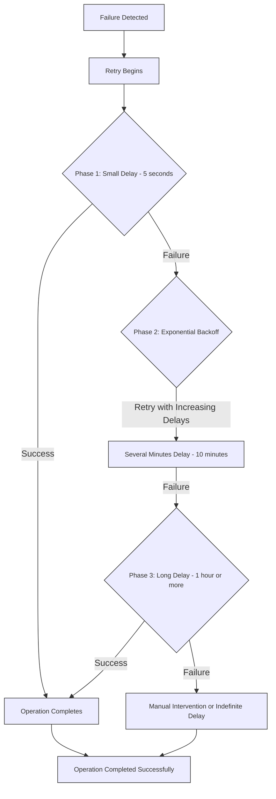

This page describes the features available in KurrentDB connectors. Before diving into the features, it's important to understand the structure of records that connectors consume from KurrentDB.

## KurrentDB Record

When a connector consumes events from KurrentDB, it receives records with the following structure:

```json
{
  "recordId": "string",
  "position": {
    "streamId": "string",
    "logPosition": "number",
  },
  "isTransformed": "boolean",
  "schemaInfo": {
    "Subject": "string",
    "Type": "number",
  },
  "headers": {
    "key1": "string"
  },
  "value": "object"
}
```

::: details Click here to see an example of KurrentDB record

```json
{
  "recordId": "af0d90b7-bc4a-4220-949f-4e92df3175c2",
  "position": {
    "streamId": "user-profile-stream",
    "logPosition": 42123
  },
  "isTransformed": false,
  "schemaInfo": {
    "subject": "UserProfileUpdated",
    "type": 1
  },
  "headers": {
    "contentType": "application/json",
    "correlationId": "corr-xyz-789",
    "userId": "user-456"
  },
  "value": {
    "firstName": "John",
    "lastName": "Doe",
    "email": "john.doe@example.com"
  }
}
```

:::

This schema serves as a reference when creating filters or transformation functions. Key components include:

- **`value`**: Contains the actual event data
- **`schemaInfo`**: Contains the event type and subject information
- **`streamId`**: Identifies the source stream of the event
- **`headers`**: Contains additional metadata, including both internal properties and custom properties

### Headers

When sink connectors process records, they automatically inject internal headers alongside any custom headers from your events. These headers provide additional metadata about the record and are prefixed with `esdb-` to distinguish them from user-defined headers.

The following internal headers are automatically added to each record:

| Header                        | Description                                                    |
| ----------------------------- | -------------------------------------------------------------- |
| `esdb-connector-id`           | The unique identifier of the connector processing the record   |
| `esdb-request-id`             | A unique identifier for the processing request                 |
| `esdb-request-date`           | The timestamp when the request was processed                   |
| `esdb-record-id`              | The unique identifier of the record                            |
| `esdb-record-timestamp`       | The timestamp of the record                                    |
| `esdb-record-redacted`        | A boolean value that indicates if the record has been redacted |
| `esdb-record-stream-id`       | The stream ID where the event originated                       |
| `esdb-record-stream-revision` | The revision number of the event in its stream                 |
| `esdb-record-log-position`    | The global log position of the event                           |
| `esdb-record-schema-subject`  | The schema subject/name of the event                           |
| `esdb-record-schema-type`     | The schema data format type                                    |

::: warning
Some connectors may send additional headers specific to their implementation
beyond the standard set listed above. Refer to the documentation for each
connector for details on any extra headers that may be included.
:::

#### User Defined Headers

If the connector allows sending headers to the sink, user-defined headers from
your events are automatically prefixed with `esdb-record-headers-`, followed by
the header name. 

By default, headers prefixed with `$` are treated as system headers and are excluded from the output. You can modify this behavior using the `"headers:ignoreSystem"` configuration setting:

```json
{
  "headers:ignoreSystem": "true"
}
```

When set to `"false"`, system headers (those prefixed with `$`) will be included in the connector output.

::: tip
Some connectors support passing extra headers beyond those listed above. See each connector's documentation for details.
:::

## Filters

All sink connectors support filtering events using regular expressions, JsonPath expressions, or prefixes. The expression is first checked as a JsonPath, then as a regex, and if neither, it's used as a prefix for filtering.

::: info
By default, if no filter is specified, the system will consume from the `$all` stream, excluding system events.
:::

### Stream ID Filter

The stream ID filter allows you to filter events based on the stream ID. This filter is applied at the stream scope, meaning it filters events by their stream ID. An example of a stream ID filter is shown below:

```json
{
  "subscription:filter:scope": "stream",
  "subscription:filter:filterType": "streamId",
  "subscription:filter:expression": "some-stream"
}
```

In this case, the filter will only match events from the `some-stream` stream.

### Regex Filters

The simplest and fastest way to filter events is by using regular expressions.
This can be done at the stream scope, which applies to the stream ID, or at the
record scope, which applies to the event type.

An example of a Regex expression is shown below:

```json
{
  "subscription:filter:scope": "record",
  "subscription:filter:filterType": "regex",
  "subscription:filter:expression": "^eventType.*"
}
```

This filter will only match records where the event type starts with
`eventType`. This filter type can be used for both `stream` and `record` scopes.

### Prefix Filters

You can also filter records by prefix using the following configuration:

```json
{
  "subscription:filter:scope": "stream",
  "subscription:filter:filterType": "prefix",
  "subscription:filter:expression": "prefix1,prefix2"
}
```

In this case, the filter will only match events where the stream ID starts with
`prefix1` or `prefix2`. This filter type can be used for both `stream` and
`record` scopes.

### JsonPath Filters

JSONPath provides a standardized string syntax for selecting and extracting JSON values from KurrentDB records. Following the [RFC 9535](https://www.rfc-editor.org/rfc/rfc9535.html#name-introduction) standard, JSONPath allows for efficient querying of JSON data within your KurrentDB connectors. The filtering process is managed at the connector level and is applied only at the record scope. JSONPath filters apply exclusively to events with the `application/json` content type.

An example of a JsonPath filter is shown below:

```json
{
  "subscription:filter:scope": "record",
  "subscription:filter:filterType": "jsonPath",
  "subscription:filter:expression": "$[?($.value.vehicle.year==2018)]"
}
```

In this case, the filter will only match events where the year field is equal to 2018.

::: tip
You can test your JSONPath expressions using the [JsonPath Playground](https://json-everything.net/json-path/). Copy the record JSON and test your expressions to ensure they work as expected.
:::

Refer to the [Subscription Configuration](./settings.md#subscription-configuration) section in settings
page for more details on the available scopes and additional configuration
options.

## Transformations

Sink connectors support transformations using JavaScript, allowing you to modify records received from KurrentDB streams before they are sent to the destination. This feature enables you to tailor the data to meet your specific requirements, such as combining fields, converting values, or enriching records.

::: info
Transformations apply exclusively to events with the `application/json` content type. Transformations are not applied to events with other content types.
:::

### How Transformations Work

Transformations are implemented as JavaScript functions that are encoded in base64 format and configured on the connector. The transformation function receives a KurrentDB record that follows the this [record structure](#kurrentdb-record) and any part of it can be modified before it's processed by the sink.

### Creating a Transformation

Follow these steps to create and apply a transformation to your connector:

#### 1. Write the transformation function in JavaScript

The transformation function must adhere to the following requirements:

- **Function name**: Must be named `transform`
- **Parameters**: Must accept a single parameter called `record` that follows the [record structure](#kurrentdb-record)
- **Mutation style**: Must directly mutate the `record` object passed as its argument. Returning a new object using immutable will not work and throw an error.

Here's an example that combines first and last names into a full name and normalizes the email address:

```js
function transform(record) {
  const { firstName, lastName, email } = record.value;
  record.value.fullName = `${firstName} ${lastName}`;
  record.value.email = email.toLowerCase();
}
```

**Input:**

This function assumes the `record.value` is a JSON object with the following structure:

```json
{
  "firstName": "John",
  "lastName": "Doe",
  "email": "John.Doe@example.com"
}
```

**Output:**

After transformation, the record will contain:

```json
{
  "email": "john.doe@example.com",
  "firstName": "John",
  "fullName": "John Doe",
  "lastName": "Doe"
}
```

#### 2. Encode the transformation function to base64

Convert your JavaScript function to a base64-encoded string. The transformation must be base64-encoded before being configured on the connector.

#### 3. Configure the connector with the encoded transformation

If you have already created your connector without transformation enabled, you can easily update its configuration to enable transformations and provide the transformation function. Use the following API call to reconfigure your sink connector:

```http
POST /connectors/{id}
Host: localhost:2113
Content-Type: application/json

{
  "transformer:enabled": "true",
  "transformer:function": "ZnVuY3Rpb24gdHJhbnNmb3JtKHJlY29yZCkgewogIGNvbnN0IHsgZmlyc3ROYW1lLCBsYXN0TmFtZSwgZW1haWwgfSA9IHJlY29yZC52YWx1ZTsKICByZWNvcmQudmFsdWUuZnVsbE5hbWUgPSBgJHtmaXJzdE5hbWV9ICR7bGFzdE5hbWV9YDsKICByZWNvcmQudmFsdWUuZW1haWwgPSBlbWFpbC50b0xvd2VyQ2FzZSgpOwp9"
}
```

You can find the list of available management API endpoints in the [API Reference](./manage.md).

#### 4. Start the connector

Once configured, start the connector to begin processing events with the transformation applied:

```http
POST /connectors/{id}/start
Host: localhost:2113
Content-Type: application/json
```

When you append an event to the target KurrentDB stream, the connector will apply the transformation function to each record before sending it to the destination.

::: info
All records that have been transformed will automatically receive a header property called `esdb-record-is-transformed` set to `true`. This header can be used in filters to identify or filter out transformed records.
:::


## Checkpointing

Connectors periodically store the position of the last event that they have
successfully processed. Then, if the connector host is restarted, the connectors
can continue from close to where they got up to. The checkpoint information is
stored in the `$connectors/{connector-id}/checkpoints` system stream in
KurrentDB. Each connector has its own dedicated stream for storing
checkpoints.

By default, when the connector is started and there are no checkpoints, it will
begin from the latest position in the stream. You can configure this behavior
using the `initialPosition` property in the settings. If you need to start from
a specific position, you can use the [Start API](./manage.md#start) with the
`position` parameter.

## Resilience

Currently, connectors only support _at least once_ delivery guarantees, meaning
that events may be delivered more than once. Events are delivered _in order_,
ensuring that event `x` is not delivered until all preceding events have been
delivered.

Most connectors have a built-in resilience mechanism to ensure the reliable
delivery of data and messages, preserving system integrity and minimizing
downtime during unexpected disruptions. To see if a connector supports
resilience, refer to the connector's individual page.

The default resilience strategy is as follows:



### Automatic Retries and Resilience Strategy

To help systems recover smoothly from disruptions, an automatic retry
strategy is in place. This approach uses [exponential backoff](https://en.wikipedia.org/wiki/Exponential_backoff) to manage
retry timing after a failure, gradually increasing the time between attempts to
balance quick recovery with system stability.

The retry process unfolds in three phases:

1. **Phase 1 – Rapid Retries**: Right after a failure, the system tries again every **5 seconds** for **up to 1 minute**. This phase addresses minor issues that may quickly resolve on their own.

2. **Phase 2 – Moderate Delays**: If the issue continues, retries slow to **every 10 minutes** for the next **1 hour**. This phase eases system strain by spacing out attempts, giving more time for resolution.

3. **Phase 3 – Extended Delays**: For issues that still aren’t resolved, the final phase sets retries to occur every **1 hour indefinitely**. This ensures ample recovery time while reducing unnecessary attempts, though manual intervention may eventually be required.

These phases allow the system to progressively adjust retry frequency, balancing resilience and performance. 

For more details on customizing these settings, refer to the [Resilience Configuration](./settings.md#resilience-configuration) section.

::: note
Some connectors have their own resilience mechanisms and configurations. Refer to the specific connector's page for details.
:::

## Data Protection

KurrentDB Connectors protect sensitive configuration fields using envelope encryption to secure confidential information such as passwords and access tokens.

When you configure a connector, the system encrypts sensitive data using Data Encryption Keys (DEKs), which are then wrapped (encrypted) using a master key based on your provided token. The encrypted data is stored securely in KurrentDB rather than in plaintext.

Refer to each connector's [individual documentation](./sinks/) to see which fields are considered sensitive and protected.

### Configuring Data Protection

To enable data protection, configure the data protection settings in your
configuration file. You can provide an encryption token using either a token
file or by specifying the token directly in the configuration.

::: warning
Once the token is set, it is permanent and must never be changed. The same token is required for all connectors, and changing it will make all previously encrypted data inaccessible. For this reason, you should treat the token as a permanent secret and never attempt to change it after initial setup.
:::

#### Using a Token File
```yaml
Connectors:
  Enabled: true
  DataProtection:
    TokenFile: "/path/to/token/file"
```

#### Using a Token Directly
```yaml
Connectors:
  Enabled: true
  DataProtection:
    Token: "<your-secret-token>"
```

::: note
If you provide both `Token` and `TokenFile`, the system will use the token file and ignore the `Token` setting.
:::

### Key Vault

KurrentDB Connectors uses the Surge key vault internally to manage encryption keys. Surge is KurrentDB's native key storage mechanism that stores encrypted keys in internal system streams. This is the default and only key vault currently available, and it is used automatically by the data protection framework without requiring any user configuration.

::: warning
The Surge key vault is managed internally by the data protection framework and should not be configured directly by users. The system handles all key vault operations automatically.
:::

Support for additional key vault options, including external key management systems, is planned for future releases.
