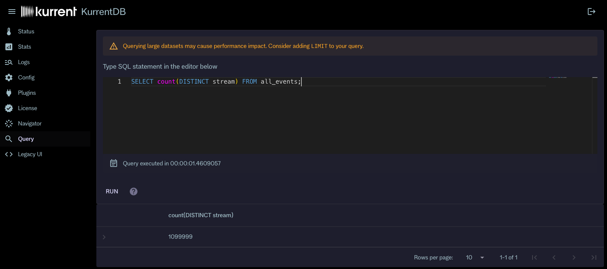

# Queries UI

<wbr><Badge type="info" vertical="middle" text="License Required"/>

The KurrentDB Web Admin UI provides a basic interface to write and run ad-hoc queries against your event streams. This is useful for quick analysis and exploration of your data without needing to set up a full projection.

::: important
The query feature is intended for temporary and exploratory use. For long-running or production workloads, consider using persistent projections or external tools.

KurrentDB currently does not have advanced query planning and is only able to use the default [secondary indexes](../indexes/secondary.md) for queries. Therefore, complex queries may not perform optimally.

When querying event data and metadata, keep in mind that the query engine processes events sequentially. For large datasets, this may lead to longer query execution times and emit a large number of read requests.
:::

## Motivation

Before v25.1, KurrentDB users had to rely on projections or external tools to query event data. We now want to offer a simpler way to run ad-hoc queries directly from the Web Admin UI, and using other protocols in the future.

There was already a way to run ad-hoc queries using [JavaScript projections](../projections/custom.md) using the Projections - Query screen, but that requires leaning the projections API and JavaScript. The new Queries UI provides a more straightforward way to run simple queries using SQL. It is powered by the [Secondary Indexes](../indexes/secondary.md) feature.

The primary goal of this feature in KurrentDB v25.1 is to provide a way to run ad-hoc queries for quick data exploration and analysis. It doesn't yet aim to replace the need for read models that would be used in production and address complex querying needs.

## Internals

The query engine uses DuckDB internally to execute SQL queries against event data stored in KurrentDB. The secondary indexes feature builds an index table in DuckDB for default indexes (category and event type), which is used to offload some of the predicates to DuckDB. Queries that require access event data and metadata would read events directly from KurrentDB.

The index table allows using predicate pushdown for filters on indexed fields, such as:
- `stream`: Stream name
- `category`: Stream category
- `event_type`: Event type
- `event_number`: Event number within the stream
- `log_position`: Log position of the event
- `created_at`: Event creation timestamp

There are two more fields are available for queries:
- `data`: Event data as JSON
- `metadata`: Event metadata as JSON

::: important
The query engine only allows predicates on data and metadata if both use JSON format. If the event data or metadata is in a different format (e.g., binary), queries that access those fields will not access event data and metadata.
:::

## How to query data

The query engine exposes two virtual tables that can be queried:
- `stream:{stream_name}`: Represents a specific stream. Replace `{stream_name}` with the actual stream name, e.g., `stream:orders-123`.
- `category:{category_name}`: Represents a specific stream category. Replace `{category_name}` with the actual category name, e.g., `category:order`.
- `all_events`: Represents all events in the database.

It's possible to query derived data from those tables using standard SQL syntax. For example, to list all streams in the database, you can use the following query:

```sql
SELECT DISTINCT stream FROM all_events;
```
To get all events of type `OrderPlaced` from the `order` category, you can use:

```sqlsql
SELECT * FROM category:order WHERE event_type = 'OrderPlaced';
```

There's no virtual table for event types, but you can query distinct event types using:

```sql
SELECT DISTINCT event_type FROM all_events;
```

Note that using `SELECT *` will forcibly read event data and metadata for all events, which may lead to high read load. It's recommended to select only the necessary fields. If the query only retrieves indexed fields, the query _would not_ read event data and metadata.

::: info Example
For example, the query that count streams in the database (`SELECT count(DISTINCT stream) FROM all_events;`) over 130 million events in 1 million streams will execute in less than two seconds on a decent machine. However, a query that retrieves all fields for all events (`SELECT * FROM all_events;`) would take much longer and generate a large number of read requests, as it would need to read event data and metadata for all events. In addition, it will enumerate the whole query result and eventually run out of memory either in the browser or on the server side.
:::

For querying data and metadata fields, you can use JSON lambda-based predicates that are compatible with PostgreSQL JSON query syntax. For example, to find events where the `amount` field in the event data is greater than 100, you can use:

```sql
SELECT * FROM stream:orders-123 WHERE data->>'amount' > 100;
```

It is possible to use joins between virtual tables and standard SQL constructs like `GROUP BY`, `ORDER BY`, and aggregation functions. Note that `GROUP BY` and `ORDER BY` queries require full result enumeration even with `LIMIT` clause, which may lead to large number of read requests for large datasets, especially when grouping on event data or metadata fields.

## Using the Queries UI

To run ad-hoc queries using the Queries UI, follow these steps:
1. Open the KurrentDB Embedded UI and navigate to the `Query` page.
2. In the query editor, enter your SQL query using the virtual tables and fields described above.
3. Click the `Run` button or press `Ctrl+Enter` or `⌘+Enter` to execute the query.
4. The results will be displayed in a tabular format below the query editor.



Click on the `?` icon next to the query editor to see a quick reference guide for the SQL syntax and available virtual tables and fields.